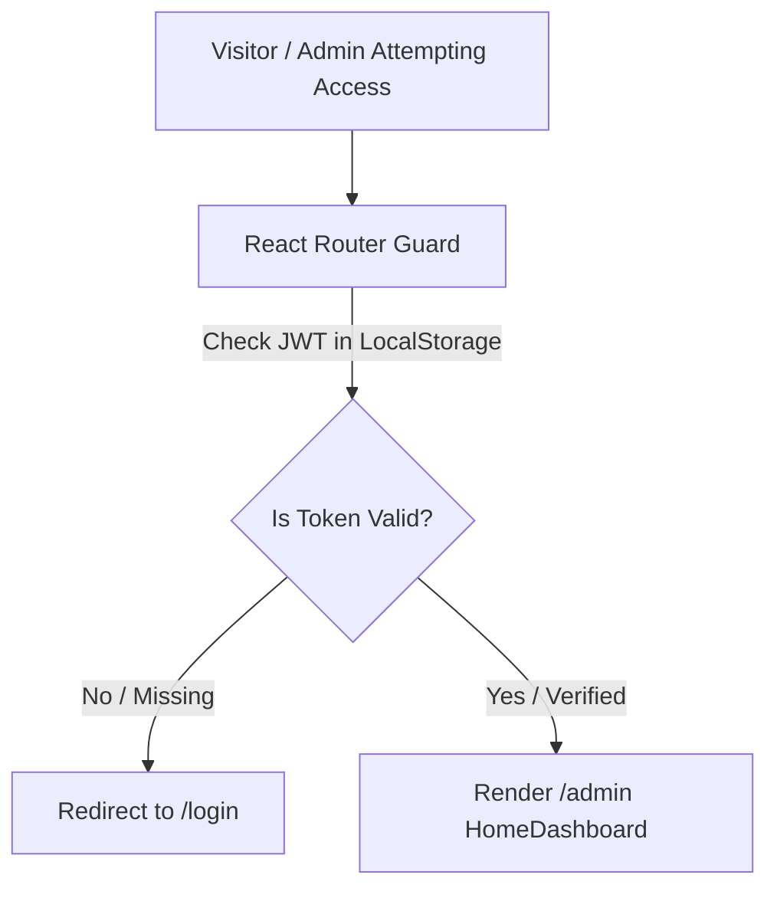

# Admin Dashboard Guide 🛠️

One of the standout enterprise features of **Portfolio V3** is its custom-built, secure **Admin Portal**. Instead of hardcoding project updates or redeploying code every time a new skill is learned or a project is launched, all content is dynamically managed through this centralized interface.

---

## 🔐 Accessing the Portal

The admin dashboard is hosted on a protected client route:
- **URL Route**: `/admin` (or `/login` if unauthenticated).
- **Security**: Unauthenticated visitors attempting to navigate to any `/admin/*` path are immediately intercepted and redirected to the login screen by React Router authentication guards.

---

## 🖥️ Admin Interface Overview

Once authenticated, the admin sidebar provides instant navigation across 11 specialized management views:

| Admin Module | Page File | Capabilities & Management Scope |
| :--- | :--- | :--- |
| **🏠 Home Dashboard** | `HomeDashboard.jsx` | High-level telemetry: total project count, pending visitor messages, quick actions, and recent activity logs. |
| **📦 Projects Manager** | `ProjectWorks.jsx` | Full CRUD operations for portfolio projects. Upload cover screenshots directly to Cloudinary, assign tech tags, set GitHub/Live URLs, and toggle feature status. |
| **⚡ Skills Matrix** | `Skills.jsx` | Add, edit, or categorize technical proficiencies (e.g., frontend frameworks, backend databases, DevOps tools). |
| **💼 Work Experience** | `Experience.jsx` | Chronological career management. Add employer details, role titles, tenure dates, and bulleted achievements. |
| **🎓 Education** | `Eduction.jsx` | Manage university degrees, certifications, and academic qualifications. |
| **🏆 Hackathons** | `Hackathon.jsx` | Showcase competitive programming achievements, hackathon victories, and project demos. |
| **📜 Certificates** | `Cerificates.jsx` | Upload official verification badges and course completion certificates from platforms like Coursera, Udemy, or AWS. |
| **🌐 Social Media** | `SocialMedia.jsx` | Update footer and hero social profile links (GitHub, LinkedIn, Twitter/X, LeetCode, Discord) in real-time. |
| **📬 Messages & Inbox** | `Messages.jsx` | Real-time inbox for visitor submissions sent via the public `/contact` form. Mark as read, reply via email, or archive. |
| **⚙️ Settings & Profile** | `Settings.jsx` / `Profile.jsx` | Account security management, password updates, and API key configurations. |

---

## 🔄 Content Management Workflow Example: Adding a Project

1. Navigate to **Projects Manager** (`/admin/projects`).
2. Click the **"+ New Project"** action button.
3. Fill in project metadata:
   - **Title**: e.g., *ShopNest Desktop*
   - **Description**: Concise elevator pitch for public card display.
   - **Tech Stack**: Comma-separated or tag-selected list (e.g., `React, Electron, Tailwind, Node.js`).
   - **Repository Link**: GitHub URL.
   - **Live Demo Link**: Production deployment URL.
4. **Attach Cover Image**: Select a local high-res screenshot. The portal automatically streams it to Cloudinary and generates a optimized web thumbnail.
5. Click **"Publish Project"**. The public `/works` and `/` pages update instantly across the globe without requiring a server rebuild!
