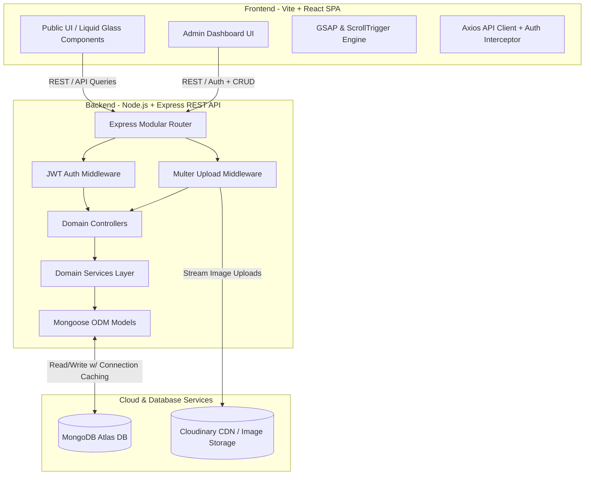

# Architecture & Tech Stack 🏗️

This document details the high-level system architecture, technology choices, and structural design patterns employed in **Rumman's Portfolio V3**.

---

## 🌐 High-Level System Architecture

Portfolio V3 follows a decoupled client-server RESTful architecture. The client is a blazing-fast Single Page Application (SPA) built with React and Vite, communicating over secure HTTPS/REST endpoints with an Express.js backend running on Node.js.



---

## 🛠️ Complete Technology Stack

### 🖥️ Frontend Stack
| Technology | Version / Tool | Purpose & Usage |
| :--- | :--- | :--- |
| **React.js** | 18+ (Vite) | Core UI library for component-based reactive frontend rendering. |
| **Tailwind CSS** | V4 | Utility-first styling engine driving the Liquid Glassmorphism design system. |
| **GSAP** | GreenSock + ScrollTrigger | Advanced timeline-based animations, scroll-linked parallax, and entrance effects. |
| **Lucide React** | Latest | Modern, clean iconography used across Bento grids and admin sidebars. |
| **React Router DOM** | v6 | Client-side routing with protected admin route wrappers and code-splitting. |
| **Axios** | Latest | HTTP client configured with base URLs, token interceptors, and error handling. |

### ⚙️ Backend Stack
| Technology | Version / Tool | Purpose & Usage |
| :--- | :--- | :--- |
| **Node.js** | 18+ LTS | Asynchronous server runtime environment. |
| **Express.js** | 4.x | Fast, minimalist web framework handling REST routing and middleware pipelines. |
| **MongoDB** | Atlas (Cloud) | NoSQL document database storing projects, skills, education, experience, and messages. |
| **Mongoose** | ODM | Schema modeling, validation, query building, and database connection caching. |
| **JSON Web Token (JWT)** | `jsonwebtoken` | Stateless authentication mechanism protecting private Admin CRUD endpoints. |
| **Bcrypt.js** | Latest | Cryptographic salt and hash algorithm for secure admin password verification. |
| **Cloudinary & Multer** | Cloud CDN | Multipart form-data handling and direct streaming to CDN for project imagery and certificates. |

---

## 🧩 Modular Backend Design Pattern

The Express backend strictly adheres to a **Domain-Driven Modular Architecture**. Instead of dumping all controllers and routes into massive single directories, each domain feature is encapsulated within its own directory in `server/src/modules/`:

```text
server/src/modules/<Domain>/
 ┣ 📜 <domain>.controller.js   # Handles HTTP requests, responses, and status codes
 ┣ 📜 <domain>.services.js     # Houses core business logic and database query operations
 ┣ 📜 <domain>.model.js        # Defines the Mongoose database schema and validation rules
 ┗ 📜 <domain>.routes.js       # Maps HTTP verbs (GET, POST, PUT, DELETE) to controller actions
```

### Advantages of this Pattern:
1. **High Cohesion & Low Coupling**: Changes to the `projects` module have zero unintended side effects on `skills` or `education`.
2. **Testability**: Service layers can be unit-tested independently of Express HTTP request/response objects.
3. **Scalability**: New portfolio sections (e.g., blog posts, testimonials) can be added cleanly as new domain modules in minutes.

---

## ⚡ Database Connection Caching

To ensure maximum performance in serverless or cloud deployment environments (such as Render or Vercel), the database configuration (`server/src/config/db.js`) implements **connection caching**:

- Prevents connection pool exhaustion by reusing existing open Mongoose connections across warm server invocations.
- Automatically handles connection dropouts with graceful reconnection retry logic and descriptive console logging.

---

## 🔒 Security Architecture

1. **Authentication Interceptors**: Client requests to `/api/admin/*` automatically attach a `Bearer <token>` in the `Authorization` header.
2. **Stateless Verification**: The backend `authMiddleware.js` verifies the JWT signature and expiration before allowing access to mutation controllers.
3. **Payload Sanitation**: Mongoose schemas enforce strict type validation, trim whitespace, and sanitize inputs before database insertion.
