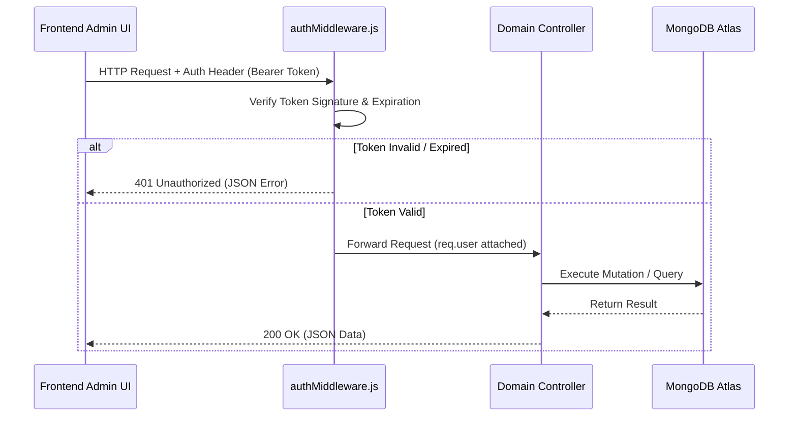
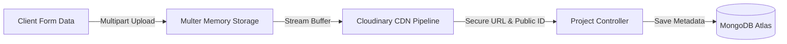

# Backend & API Reference 🗄️

The server side of **Portfolio V3** is powered by a robust **Node.js** and **Express.js** API, connected to a **MongoDB Atlas** cloud database and integrated with **Cloudinary** for scalable image hosting.

---

## 📡 REST API Architecture & Standards

All backend routes are prefixed with `/api`. The API adheres to RESTful standards, utilizing semantic HTTP methods and returning structured JSON payloads:

### Standard Response Format
```json
{
  "success": true,
  "data": { ... },
  "message": "Operation completed successfully."
}
```

### Standard Error Format
```json
{
  "success": false,
  "error": "Detailed error description or validation failure message."
}
```

---

## 🔑 Authentication & Authorization

Protected Admin routes require a valid JSON Web Token (JWT) transmitted in the request header:
```http
Authorization: Bearer <your_jwt_access_token>
```



---

## 🗺️ Exhaustive API Endpoint Reference

### 📁 Projects Module (`/api/projects`)
| Method | Endpoint | Auth Required? | Description |
| :--- | :--- | :--- | :--- |
| **GET** | `/api/projects` | No | Retrieve all published portfolio projects. |
| **GET** | `/api/projects/:id` | No | Retrieve detailed metadata for a specific project by ID. |
| **POST** | `/api/projects` | 🔒 Yes (Admin) | Create and publish a new project (accepts multipart image uploads). |
| **PUT** | `/api/projects/:id` | 🔒 Yes (Admin) | Update existing project details, links, or screenshots. |
| **DELETE** | `/api/projects/:id` | 🔒 Yes (Admin) | Delete a project from database and remove associated CDN images. |

### ⚡ Skills Module (`/api/skills`)
| Method | Endpoint | Auth Required? | Description |
| :--- | :--- | :--- | :--- |
| **GET** | `/api/skills` | No | Fetch all technical skills grouped by category (Frontend, Backend, Tools). |
| **POST** | `/api/skills` | 🔒 Yes (Admin) | Add a new technical skill and proficiency level. |
| **PUT** | `/api/skills/:id` | 🔒 Yes (Admin) | Update skill proficiency or category. |
| **DELETE** | `/api/skills/:id` | 🔒 Yes (Admin) | Remove a skill from the matrix. |

### 💼 Experience Module (`/api/experience`)
| Method | Endpoint | Auth Required? | Description |
| :--- | :--- | :--- | :--- |
| **GET** | `/api/experience` | No | Retrieve chronological work and internship experience history. |
| **POST** | `/api/experience` | 🔒 Yes (Admin) | Add a new professional role or career milestone. |
| **PUT** | `/api/experience/:id` | 🔒 Yes (Admin) | Modify existing job description, dates, or company details. |
| **DELETE** | `/api/experience/:id` | 🔒 Yes (Admin) | Delete an experience entry. |

### 🎓 Education Module (`/api/education`)
| Method | Endpoint | Auth Required? | Description |
| :--- | :--- | :--- | :--- |
| **GET** | `/api/education` | No | Fetch academic qualifications and degree history. |
| **POST** | `/api/education` | 🔒 Yes (Admin) | Add a new educational institution or qualification. |
| **PUT** | `/api/education/:id` | 🔒 Yes (Admin) | Update grade, degree, or timeline information. |
| **DELETE** | `/api/education/:id` | 🔒 Yes (Admin) | Remove an education record. |

### 🏆 Hackathons & Certificates (`/api/hackathon`, `/api/certificates`)
| Method | Endpoint | Auth Required? | Description |
| :--- | :--- | :--- | :--- |
| **GET** | `/api/hackathon` / `/api/certificates` | No | List all hackathon achievements and certified achievements. |
| **POST** | `/api/hackathon` / `/api/certificates` | 🔒 Yes (Admin) | Upload new certificate credentials or hackathon wins. |
| **PUT** | `/api/*/:id` | 🔒 Yes (Admin) | Edit certificate metadata or verification URLs. |
| **DELETE** | `/api/*/:id` | 🔒 Yes (Admin) | Remove certificate or hackathon record. |

### 📬 Contact & Notifications (`/api/contact`, `/api/notifications`)
| Method | Endpoint | Auth Required? | Description |
| :--- | :--- | :--- | :--- |
| **POST** | `/api/contact` | No | Submit a new contact form message from public visitors. |
| **GET** | `/api/notifications` | 🔒 Yes (Admin) | Retrieve all unread visitor messages and system notifications. |
| **DELETE** | `/api/notifications/:id` | 🔒 Yes (Admin) | Dismiss or archive a processed notification message. |

### 🛡️ Admin Auth Module (`/api/admin`)
| Method | Endpoint | Auth Required? | Description |
| :--- | :--- | :--- | :--- |
| **POST** | `/api/admin/login` | No | Authenticate admin credentials and issue a signed JWT session token. |
| **GET** | `/api/admin/profile` | 🔒 Yes (Admin) | Verify active session token and return authenticated user details. |

---

## ☁️ Cloudinary & Multer File Upload Pipeline

When creating or updating projects and certificates that include image attachments, the backend executes an automated streaming pipeline:



1. **Multer Middleware (`uploadMiddleware.js`)**: Intercepts incoming multipart form requests and stores file buffers in RAM without writing temporary files to local disk.
2. **Cloudinary Stream (`config/cloudinary.js`)**: Pipes memory buffers directly to Cloudinary CDN, automatically optimizing compression and converting formats to modern WebP.
3. **Database Persistence**: The returned `secure_url` and `public_id` are saved in MongoDB, ensuring effortless deletion and updating later.
