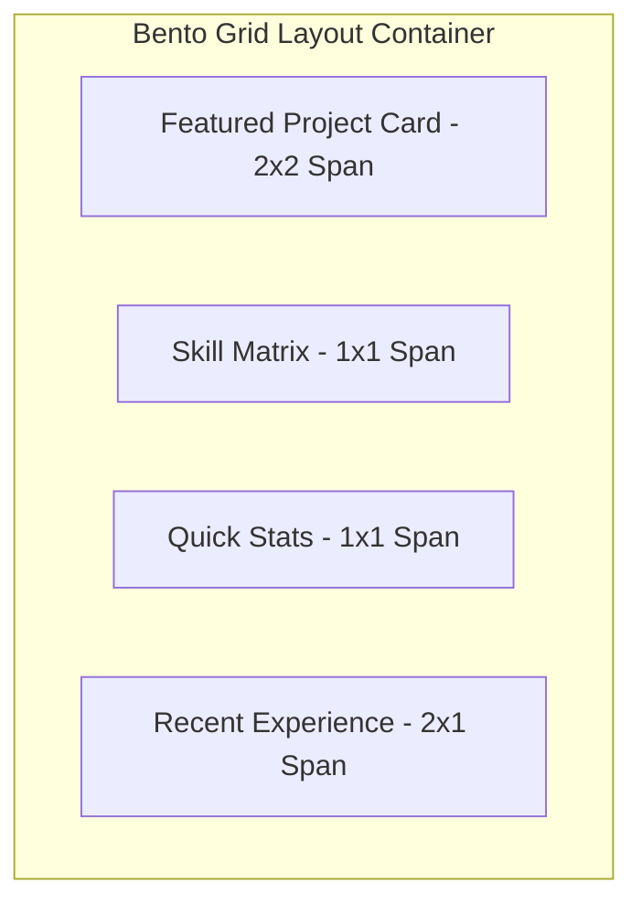

# Frontend Guide 🎨

The client side of **Portfolio V3** is engineered to deliver a visually stunning, ultra-smooth user experience. Built on **React 18** and **Vite**, it combines modern utility-first styling with cinematic animations.

---

## 🖌️ The "Liquid Glass" Styling Engine

Styling is driven by **Tailwind CSS V4**. The signature **Liquid Glass** aesthetic is achieved through a consistent application of visual design tokens across all components and page layouts:

### 1. Glassmorphism Tokens
- **Backdrop Blur**: Utilizes `backdrop-blur-md`, `backdrop-blur-lg`, and `backdrop-blur-xl` to create depth against dark, atmospheric background gradients.
- **Translucent Borders**: Subtle 1px borders using white opacity gradients (`border border-white/10` or `border-white/15`) give cards a tactile, polished glass edge.
- **Surface Gradients**: Card backgrounds utilize subtle radial or linear gradients (`bg-gradient-to-br from-white/[0.07] to-white/[0.02]`) to mimic light refraction.

### 2. Glowing Ambient Shadows
- Interactive components feature ambient colored drop shadows (`shadow-[0_0_30px_rgba(59,130,246,0.15)]`) that intensify upon hover or focus, creating a responsive, alive interface.

---

## ⚡ GSAP & ScrollTrigger Animation Workflows

Instead of simple CSS transitions, **Portfolio V3** integrates GreenSock (GSAP) and ScrollTrigger for high-performance, choregraphed motion:

### 1. Parallax Scrolling & Hero Reveals
- When landing on `Home.jsx` or `About.jsx`, GSAP timelines orchestrate staggered text reveals (`opacity: 0` to `opacity: 1` with `y: 40` upwards translations).
- ScrollTrigger monitors DOM scroll progress to smoothly fade in Bento grid cards and technical competency bars as they enter the browser viewport.

### 2. Interactive Micro-Animations
- **Hover Transitions**: Buttons and cards use GSAP or Tailwind hover states for smooth scaling (`hover:scale-[1.02]`) and color shifts.
- **Smooth Page Transitions**: Route navigation is cushioned by fade-in and fade-out effects, preventing jarring layout shifts during page changes.

---

## 📐 Responsive Bento Grid Layouts

To present complex information cleanly, the frontend heavily utilizes **Bento Grids** (inspired by modern Apple and linear design systems):

- **Desktop Layouts**: Asymmetric grid columns (`grid-cols-1 md:grid-cols-3 lg:grid-cols-4`) allow high-priority items (like flagship projects) to span multiple rows or columns.
- **Mobile Adaptability**: On screens smaller than 768px, grid spans automatically collapse into a clean, vertically stacked single-column scroll hierarchy, ensuring zero horizontal scrolling or squished typography.

---

## 📂 Public Pages Breakdown

| Page Module | Path | Description & Features |
| :--- | :--- | :--- |
| **`Home.jsx`** | `/` | The hero landing experience. Features dynamic intro typography, animated call-to-action buttons, and a curated snapshot of top projects. |
| **`About.jsx`** | `/about` | A comprehensive dive into Rumman's background, educational timeline, work experience history, and interactive skill proficiency grids. |
| **`Works.jsx`** | `/works` | A filterable, interactive showcase of all developed applications, categorizable by tech stack (e.g., Full Stack, Frontend, AI/ML). |
| **`ProjectDetails.jsx`** | `/works/:id` | Deep-dive page for individual projects. Displays high-res screenshots, architecture breakdowns, key features list, live demo links, and GitHub repository links. |
| **`Contact.jsx`** | `/contact` | An interactive communication portal with direct social links and an integrated messaging form that sends notifications directly to the backend database. |

---

## 🛠️ State Management & Custom Hooks

- **Axios Service Layer (`src/services/`)**: Centralizes all API communications. Configures base URL endpoints and injects authentication headers automatically for admin requests.
- **React Context & Hooks (`src/context/`, `src/hooks/`)**: Manages global UI state, theme toggling, and user authentication session persistence across browser refreshes.
